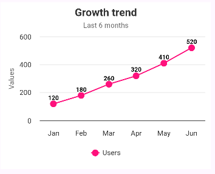
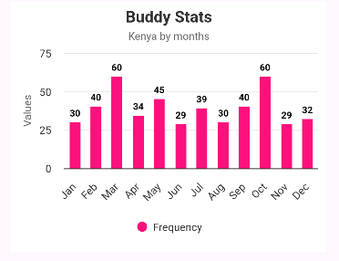
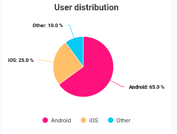
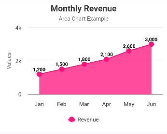
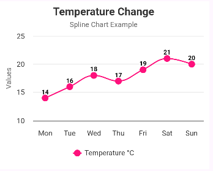
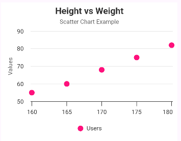
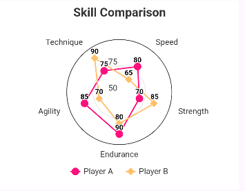

# AAChartCore-Kotlin 📊

## Zakaj AAChartCore-Kotlin? 🤔

AAChartCore-Kotlin je odprtokodna Android knjižnica za prikaz grafov in diagramov, ki temelji na preverjenem **Highcharts JavaScript** jedru. Za izris uporablja **WebView**, kar omogoča prikaz interaktivnih, animiranih in vizualno dovršenih grafov brez potrebe po ročnem risanju ali zapleteni grafični logiki.

Knjižnica je posebej primerna za aplikacije, kjer je pomembna pregledna predstavitev podatkov, kot so statistika, analitika, meritve senzorjev, finančni podatki ali uporabniški dashboardi.

---

## Prednosti ✅

- Podpora za veliko različnih vrst grafov (line, bar, column, pie, area, scatter …)
- Interaktivni grafi z animacijami in tooltip-i
- Enostavna uporaba z deklarativnim pristopom (model + view)
- Visoka prilagodljivost videza (barve, osi, naslovi, legende)
- Profesionalen in sodoben vizualni izgled grafov

---

## Slabosti ❌

- Izris poteka preko WebView-a, kar pomeni nekoliko večjo porabo pomnilnika
- Manj primerna za zelo velike količine podatkov
- Zmogljivost je odvisna od naprave in WebView implementacije

---

## Licenca 📚

AAChartCore-Kotlin je licencirana pod:

**Apache License 2.0**

- prosta uporaba za osebne, izobraževalne in komercialne projekte  
- odprtokodna in prilagodljiva rešitev  

---

## Ocenitev števila uporabnikov 👤

AAChartCore-Kotlin ima **veliko število uporabnikov** in se pogosto uporablja v Android projektih po vsem svetu. Priljubljenost knjižnice je razvidna iz aktivnosti na GitHubu, velikega števila zvezdic, forkov ter številnih primerov uporabe v realnih aplikacijah.

---

## Časovna in prostorska zahtevnost ⏰💾

Časovna zahtevnost izrisa grafov je **O(n)**, kjer je *n* število podatkovnih točk, saj se vsaka točka obdela in izriše v JavaScript okolju znotraj WebView-a.

Prostorska zahtevnost je prav tako **O(n)**, dodatno pa zaradi uporabe **WebView** knjižnica porabi približno **5–15 MB RAM-a**, odvisno od naprave, verzije WebView-a in kompleksnosti grafa. Sama knjižnica zavzame le nekaj sto KB prostora v aplikaciji, večina porabe pomnilnika pa izhaja iz WebView komponente.

---

## Vzdrževanje 🔧

Knjižnica AAChartCore-Kotlin je **aktivno vzdrževana** s strani odprtokodne skupnosti. Popravki, izboljšave in nove funkcionalnosti se redno objavljajo na GitHubu, kar zagotavlja stabilnost in kompatibilnost z novejšimi verzijami Android SDK-ja.

---

## Primeri uporabe

### Dodajanje odvisnosti

```gradle
dependencies {
    implementation("com.github.AAChartModel:AAChartCore-Kotlin:7.2.0")
}
```

### Line graf (črtni graf)
```kotlin
private fun drawLineChart() {
        val model = baseAnimation(
            AAChartModel()
                .chartType(AAChartType.Line)
                .title("Growth trend")
                .subtitle("Last 6 months")
                .categories(arrayOf("Jan","Feb","Mar","Apr","May","Jun"))
                .series(
                    arrayOf(
                        AASeriesElement()
                            .name("Users")
                            .data(arrayOf(120,180,260,320,410,520))
                    )
                )
        )
        binding.aaChartViewLine.aa_drawChartWithChartModel(model)
    }
```


### Column graf (stolpčni graf)
```kotlin
private fun drawChartByMonths() {
        val model = baseAnimation(
            AAChartModel()
                .chartType(AAChartType.Column)
                .title("Buddy Stats")
                .subtitle("Kenya by months")
                .categories(arrayOf(
                    "Jan","Feb","Mar","Apr","May","Jun",
                    "Jul","Aug","Sep","Oct","Nov","Dec"
                ))
                .series(
                    arrayOf(
                        AASeriesElement()
                            .name("Frequency")
                            .data(arrayOf(30,40,60,34,45,29,39,30,40,60,29,32))
                    )
                )
        )
        binding.aaChartViewMonth.aa_drawChartWithChartModel(model)
}
```


### Bar graf (horizontalni graf)
```kotlin
private fun drawChartByYears() {
    val model = baseAnimation(
        AAChartModel()
            .chartType(AAChartType.Bar)
            .title("Buddy Stats")
            .subtitle("Kenya by years")
            .categories(arrayOf(
                "2019","2020","2021","2022","2023","2024"
            ))
            .series(
                arrayOf(
                    AASeriesElement()
                        .name("Frequency")
                        .data(arrayOf(390,300,400,600,290,320))
                )
            )
    )
    binding.aaChartViewYear.aa_drawChartWithChartModel(model)
}
```


### Pie graf (tortni graf)
```kotlin
private fun drawPieChart() {
    val model = baseAnimation(
        AAChartModel()
            .chartType(AAChartType.Pie)
            .title("User distribution")
            .series(
                arrayOf(
                    AASeriesElement()
                        .name("Share")
                        .data(arrayOf(
                            arrayOf("Android", 65),
                            arrayOf("iOS", 25),
                            arrayOf("Other", 10)
                        ))
                )
            )
    )
    binding.aaChartViewPie.aa_drawChartWithChartModel(model)
}
```


### Area graf (površinski graf)
```kotlin
private fun drawAreaChart() {
    val model = AAChartModel()
        .chartType(AAChartType.Area)
        .title("Monthly Revenue")
        .subtitle("Area Chart Example")
        .categories(arrayOf("Jan","Feb","Mar","Apr","May","Jun"))
        .series(
            arrayOf(
                AASeriesElement()
                    .name("Revenue")
                    .data(arrayOf(1200, 1500, 1800, 2100, 2600, 3000))
            )
        )
        .dataLabelsEnabled(true)
        .animationType(AAChartAnimationType.EaseOutCubic)

    binding.aaChartViewArea.aa_drawChartWithChartModel(model)
}
```


### Spline graf (gladki linijski graf)
```kotlin
private fun drawSplineChart() {
    val model = AAChartModel()
        .chartType(AAChartType.Spline)
        .title("Temperature Change")
        .subtitle("Spline Chart Example")
        .categories(arrayOf("Mon","Tue","Wed","Thu","Fri","Sat","Sun"))
        .series(
            arrayOf(
                AASeriesElement()
                    .name("Temperature °C")
                    .data(arrayOf(14, 16, 18, 17, 19, 21, 20))
            )
        )
        .dataLabelsEnabled(true)

    binding.aaChartViewSpline.aa_drawChartWithChartModel(model)
}
```


### Scatter graf (raztreseni graf)
```kotlin
private fun drawScatterChart() {
    val model = AAChartModel()
        .chartType(AAChartType.Scatter)
        .title("Height vs Weight")
        .subtitle("Scatter Chart Example")
        .series(
            arrayOf(
                AASeriesElement()
                    .name("Users")
                    .data(arrayOf(
                        arrayOf(160, 55),
                        arrayOf(165, 60),
                        arrayOf(170, 68),
                        arrayOf(175, 75),
                        arrayOf(180, 82)
                    ))
            )
        )
        .animationType(AAChartAnimationType.Elastic)

    binding.aaChartViewScatter.aa_drawChartWithChartModel(model)
}
```


### Radar (Spider) graf
```kotlin
private fun drawRadarChart() {
    val model = AAChartModel()
        .chartType(AAChartType.Line)
        .polar(true)
        .title("Skill Comparison")
        .categories(arrayOf(
            "Speed", "Strength", "Endurance",
            "Agility", "Technique"
        ))
        .series(
            arrayOf(
                AASeriesElement()
                    .name("Player A")
                    .data(arrayOf(80, 70, 90, 85, 75)),
                AASeriesElement()
                    .name("Player B")
                    .data(arrayOf(65, 85, 80, 70, 90))
            )
        )
        .dataLabelsEnabled(true)

    binding.aaChartViewRadar.aa_drawChartWithChartModel(model)
}
```



## Animacije grafov 🎞️

Knjižnica **AAChartCore-Kotlin** omogoča tudi **animacije grafov**, ki poskrbijo za boljšo preglednost in prijetnejšo uporabniško izkušnjo. Ob izrisu se grafi lahko animirano prikažejo, kar uporabniku olajša razumevanje sprememb in trendov v podatkih.

Na voljo so različni tipi animacij (npr. elastični, gladki ali odskočni prehodi), prav tako pa je mogoče nastaviti **trajanje animacije**. Animacije se izvajajo v JavaScript okolju znotraj WebView-a in delujejo tekoče tudi pri bolj kompleksnih grafih.


## Uporaba v aplikaciji 📱

Knjižnico sem uporabila v drugi aplikaciji pri predmetu PORA za prikazovanje statistike in analitičnih podatkov.
